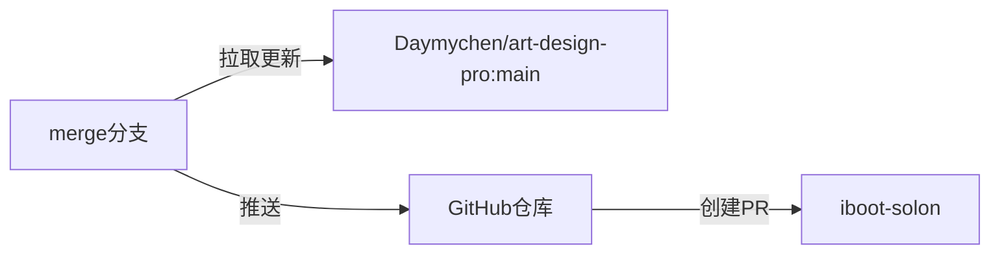
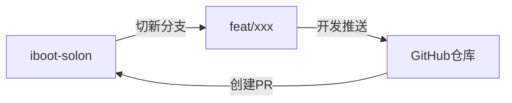
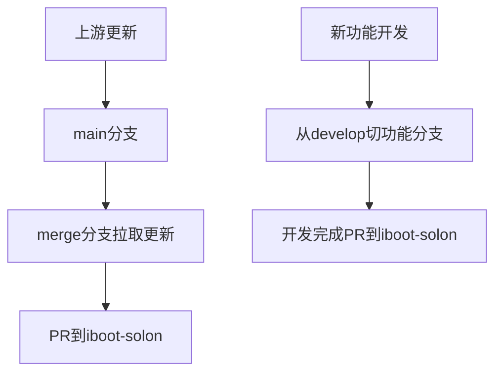

English | [简体中文](./README.zh-CN.md)

# 分支说明

```text
anganing/art-design-pro (Forked from Daymychen/art-design-pro)
├── main                      # 用于同步上游 main 分支
│
└── iboot-solon               # 主开发分支 (从 main 分支切出)
    ├── 开发规则：
    │   - 禁止直接提交代码
    │   - 仅接受来自 merge/develop 分支的合并请求
    │
    ├── merge                 # 同步分支 (从 iboot-solon 切出)
    │   └── 用途：定期合并上游 main 分支代码
    │       → 通过 PR 合并到 iboot-solon
    │
    └── develop               # 功能开发分支 (从 iboot-solon 切出)
        └── 流程：
            - 开发完成后 → PR 到 iboot-solon
            - 通过测试后合并
```

## 同步上游更新流程

```shell
git checkout merge
git merge upstream/main
# 解决冲突后
git commit -m 'fix: resolve upstream conflicts'
git push origin merge
```



## 功能开发流程



## 关键流程



## About Art Design Pro

As a developer, I needed to build admin management systems for multiple projects but found that traditional systems couldn't fully meet the requirements for user experience and visual design. Therefore, I created Art Design Pro, an open-source admin management solution focused on user experience and rapid development. Based on the ElementPlus design specifications, it has been visually optimized to provide a more beautiful and practical front-end interface, helping you easily build high-quality admin systems.

## Demo Images

### Light Theme


### Dark Theme


## Features

- Uses the latest technology stack
- Built-in common business component templates
- Provides multiple theme modes and customizable themes
- Beautiful UI design, excellent user experience, and attention to detail
- System fully supports customization, meeting your personalized needs

## Functionality

- Rich theme switching
- Global search
- Lock screen
- Multi-tabs
- Global breadcrumbs
- Multi-language support
- Icon library
- Rich text editor
- Echarts charts
- Utils toolkit
- Network exception handling
- Route-level authentication
- Sidebar menu authentication
- Authentication directives
- Mobile adaptation
- Excellent persistent storage solution
- Local data storage validation
- Code commit validation and formatting
- Code commit standardization

## Compatibility

- Supports modern mainstream browsers such as Chrome, Safari, Firefox, etc.

## Installation and Running

```bash
# Install dependencies
pnpm install

# If pnpm install fails, try using the following command to install dependencies
pnpm install --ignore-scripts

# Start local development environment
pnpm dev

# Build for production
pnpm build
```

## Technical Support

QQ Group: <a href="https://qm.qq.com/cgi-bin/qm/qr?k=Gg6yzZLFaNgmRhK0T5Qcjf7-XcAFWWXm&jump_from=webapi&authKey=YpRKVJQyFKYbGTiKw0GJ/YQXnNF+GdXNZC5beQQqnGZTvuLlXoMO7nw5fNXvmVhA">821834289</a> (Click the link to join the group chat)

## Donation

If my project has been helpful to you, donations are welcome! Your support will be used to purchase tools like ChatGPT, Cursor, etc., to improve development efficiency and make the project even better. Thank you for your encouragement and support!


